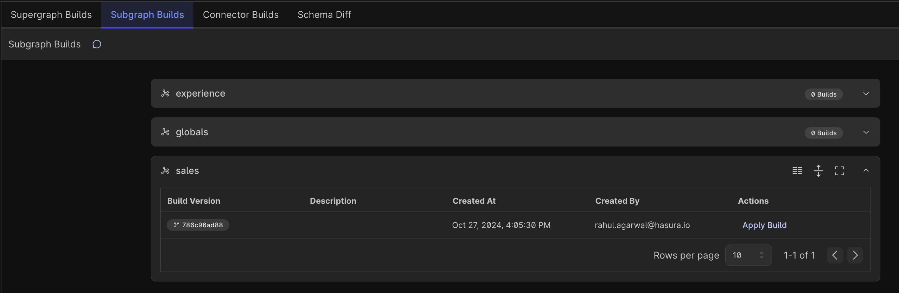
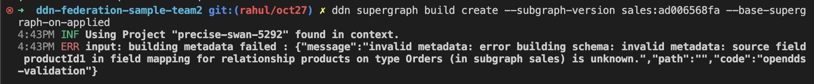

**Context: You have been invited to DDN Project by the owner of a supergraph (Team1)**
Next step of the workflow mentioned here - https://github.com/hasura/ddn-sample-app/tree/multirepo/team1admin

You are subgraph admin for the `sales` subgraphs/domain. Git clone this repo.

1. Go to hasura.console.io and accept the invite and expore the experience subgraph by Team1
2. Go to Settings in the console and copy the project name.
3. `ddn context set project <project-name>`
4. Test locally
If you are starting from scratch you would use the following two commands, but that work is already done in this example repo.

```bash
## ddn subgraph init sales --dir ./sales
## ddn subgraph add --subgraph ./sales/subgraph.yaml --target-supergraph ./supergraph.yaml
```

5. `ddn supergraph build local`
6. `ddn run docker-start`

## DDN Advanced CI/CD

1. Create Subgraph Build
```bash
ddn subgraph build create --subgraph sales/subgraph.yaml
# ddn subgraph build create --subgraph sales/subgraph.yaml --no-build-connectors
```

2. Go to Console - Subgraph builds appear



But you still need one more step to test

3. `ddn supergraph build create --subgraph-version sales:<version_number> --base-supergraph-on-applied`
Here DDN control does a cross repo (subgraph) check to ensure that there are no breaking changes to the larger API.

This is a signficant milestone since the subgraph developer is able to push to Team1 project anf get a test-able API.

4. Go to Console -explorer - sales subgraph is added
5. Add a comment on the productId in Products table for a multi repo relationship
6. Add the following multi repo relationship in file `sales/metadata/Orders.hml`
```yaml
---
kind: Relationship
version: v1
definition:
  name: products
  source: Orders
  target:
    model:
      name: Products
      subgraph: experience
      relationshipType: Object
  mapping:
    - source:
        fieldPath:
          - fieldName: productId
      target:
        modelField:
          - fieldName: id
```

7. Create Subgraph Build
```bash
ddn subgraph build create --subgraph sales/subgraph.yaml
# ddn subgraph build create --subgraph sales/subgraph.yaml --no-build-connectors
```
8.  `ddn supergraph build create --subgraph-version sales:<version_number> --base-supergraph-on-applied`

Go to console to see the new relationship

9. Make an error in the metadata for example change the name of this `fieldName: productId`
`ddn subgraph build create --subgraph sales/subgraph.yaml` goes fine
but
 `ddn supergraph build create --subgraph-version sales:<version_number> --base-supergraph-on-applied`
throws the following error because of the cross repo inconsistency
<br><br>


This is critical - first time pre commit, pre build - over time provide compiler type safety and experience
Correct the above error and build subgraph again. Now you can ask for a PR Merge Request. 

10.  Subgraph Admin - Tests the new build using the PR and decides to merge it to main


**Only Subgraph Admin Step below - can cause breaking behaviour!** 

`ddn subgraph build apply <version>`

Go to console to show new build applied.